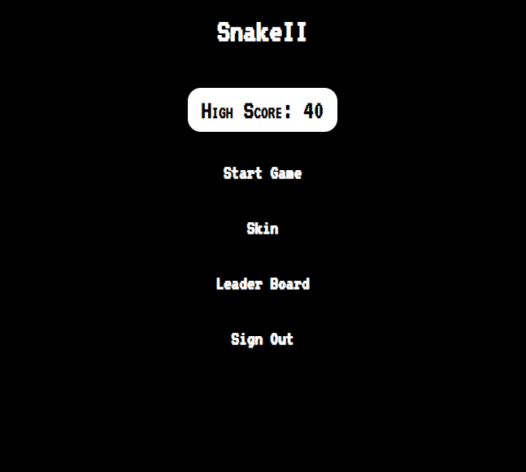
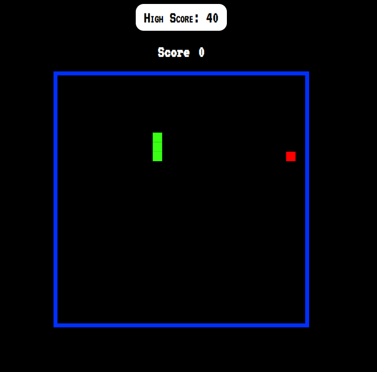

# Snake_II

A full stack TypeScript project that allows users to play snake and upload scores to a leaderboard

http://snake-ii-dev.us-east-1.elasticbeanstalk.com/

## technologies used

Typescript, CSS, Shell, HTML, PostgreSQL, Node

## future features

updating users scores, signing out, add enemies to the game, add customizable colors to the snake
